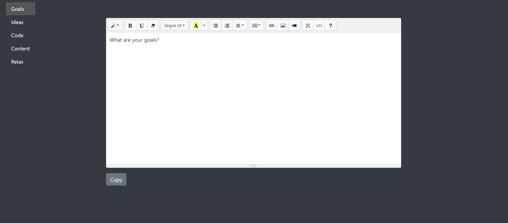

# Deepist
🥁 Introducing Deepist, the new distraction-free workspace 
       
🎤 Are you paid to produce deep work? Read on!

Demo: https://opensourcetreasure.github.io/Deepist/index.html

🎷 Let's take a look at the interface

✅ The name Deepist doesn't appear

✅ There is no title or favicon

✅ No logos or icons

✅ No top navigation bar and no footer

✅ No scrolling

✅ No cookies

✅ No admin area

✅ No notifications

✅ No chat

😏 These are features, not bugs. 

There are sections for you to write about your goals, ideas, coding, content and even a Relax button to chill out when you want.

Many professionals are expected to do what is called "Deep Work". But the productivity and collaboration tools on the market are full of distractions and what is called "feature creep". How can you come up with a deep thought when the typical page resembles a social media theme, with colorful buttons and flickering lights? Sometimes it seems that today's productivity & collaboration tools are in a race to see who can get your attention the most. 

💬 Is that in your interest?

Deepist is a minimalist, distraction-free workspace where you do your Deep Work. When you are done, click Copy and paste your deep work into whatever distractive tool you use.

💡 PS - When you have many browser tabs open, Deepist is the one without the title and favicon!

Installation

1. npm init -y in terminal from the app folder
2. npm install bootstrap@5.3.3 codemirror@5.65.16 summernote@0.8.20
3. npm install --save bootstrap@5.3.3 codemirror@5.65.16 summernote@0.8.20
4. npm install
5. Load index.html

Enjoy!

   
